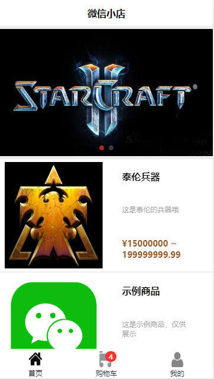
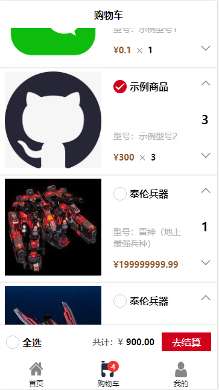
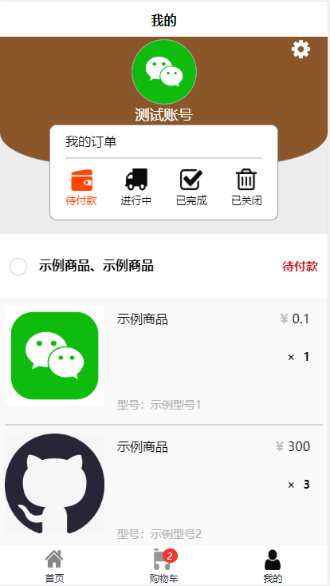
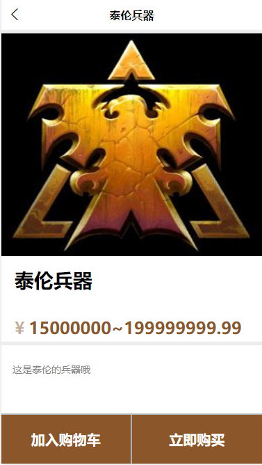
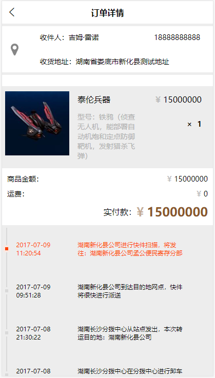

# tinystore

> 微信小店（使用 uni-app 开发，多端兼容）

## 截图展示

<p>
  
  
  
  
  
</p>

## 项目说明

> 本项目基于[uni-app](https://uniapp.dcloud.io)
（[Vue.js](https://vuejs.org) 开发的跨平台应用的前端框架），一套代码即可搞定IOS、Android、H5、小程序等多个平台。

``` bash
$ vue create -p dcloudio/uni-preset-vue my-project
```

## 运行步骤

* 编译运行
  - 小程序 `$ npm run dev`
  - 网页 `$ npm run dev:h5`

* 生产构建
  - 小程序 `$ npm run build`
  - 网页 `$ npm run build:h5`

* 查看调试
  - 小程序 使用微信开发者工具打开 `dist/dev/mp-weixin`
  - 网页 通过浏览器访问 `localhost:8080`

## api 地址

* Django后台 https://app.33code.online/api
